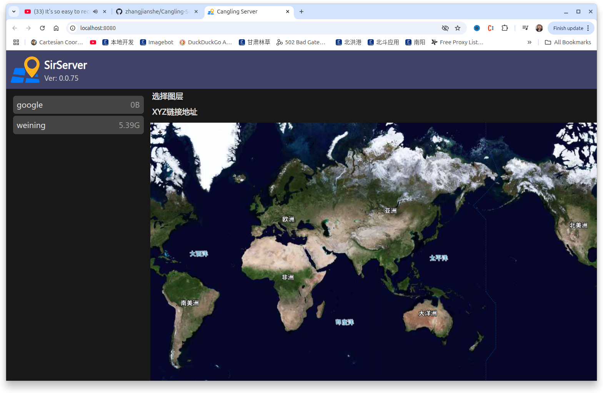

# Cangling Server

Cangling Server is a map server.

# release a new version
```shell
  ./release.sh
```

# start a server local
```shell
  ./SirServer serve -r /path/to/repository/root -o -p8080 
```

# command helper
```shell
  ./SirServer -h
  ./SirServer serve -h
```

# docker start
```shell
   docker run -it --name sir --rm -p 8080:8080 -v /mnt/cangling/devdata/share:/repo sir-serve:latest  
```

# Example



